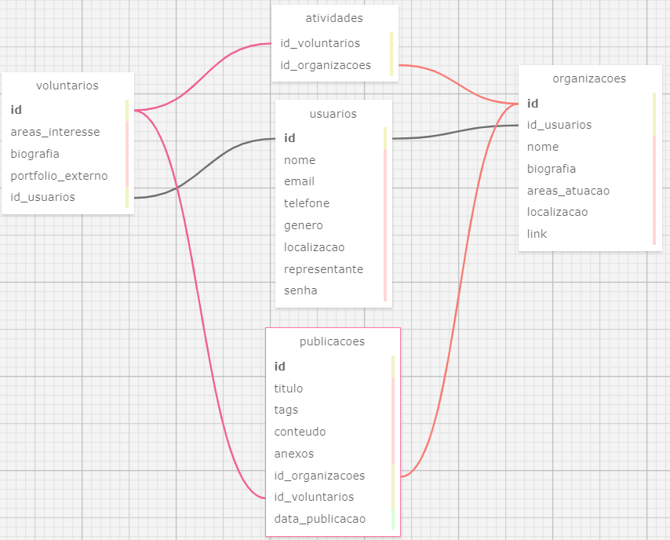

# Atividade ponderada 3 de Computação

Estudante: Nataly de Souza Cunha | T11 | G01

Professor: <a href="https://www.linkedin.com/in/cristiano-benites-687647a8/">Prof. Me. Cristiano Benites</a> 

## 🎯 Objetivos da atividade

&nbsp;&nbsp;&nbsp;&nbsp;Através da resolução da atividade, espera-se o maior entendimento teórico e prático de modelagem de dados relacional e física, bem como relacionamentos entre tabelas e cardinalidades.

## 💻 Modelagem de dados

&nbsp;&nbsp;&nbsp;&nbsp;A modelagem conceitual trata-se da primeira etapa na elaboração de um banco de dados a ser associado a um software. Nesse passo, ocorre um levantamento, análise e validação de que tipos de informações devem ser armazenados no banco, bem como a sua demonstração visual, permitindo uma planejamento tangível da estrutura. Para a representação aplicada ao presente trabalho, é utilizado o Modelo Lógico-Relacional, um modelo de dados realístico em relação ao funcionamento e organização das informações de um projeto (ELMASRI et al., 2005).<br>
&nbsp;&nbsp;&nbsp;&nbsp;Nesta atividade, houve a construção de uma representação da organização dos dados da plataforma *Oportoniza*, uma plataforma *web* criada para a Parceiros Voluntários com o *framework Sails*, de forma a fomentar a centralização e conexão de diferentes organizações, causas sociais e voluntários em um só lugar, com o objetivo de fomentar a cultura de transformação social no Brasil. A seguir, observa-se essa modelagem feita com a ferramenta online <a href="https://github.com/ondras/wwwsqldesigner">*SQLDesigner*</a>. <br>

<div align="center">



<sup>Fonte: Autoria própria (2024)</sup>

</div>

&nbsp;&nbsp;&nbsp;&nbsp;Abaixo, essa representação também está disponível em seu modelo físico, codificado em *PostgreSQL*. É possível visualizá-la em formato SQL e XML adentrando a pasta *arquivos_bd* neste repositório.

```sql
CREATE TABLE usuarios (
  id SERIAL PRIMARY KEY,
  nome VARCHAR(80) NOT NULL,
  email VARCHAR(50) NOT NULL,
  telefone VARCHAR(18) NOT NULL,
  genero VARCHAR(20) NOT NULL,
  localizacao VARCHAR(100) NOT NULL,
  representante BOOLEAN NOT NULL,
  senha VARCHAR(30) NOT NULL
);
	
CREATE TABLE organizacoes (
  id SERIAL PRIMARY KEY,
  nome VARCHAR(100) NOT NULL,
  biografia TEXT NOT NULL,
  areas_atuacao VARCHAR(100) NOT NULL,
  localizacao VARCHAR(100) NOT NULL,
  link TEXT NOT NULL,
  id_usuarios INTEGER REFERENCES usuarios(id)
);
		
CREATE TABLE voluntarios (
  id SERIAL PRIMARY KEY,
  areas_interesse VARCHAR(100) NOT NULL,
  biografia TEXT NOT NULL,
  portfolio_externo TEXT NOT NULL,
  id_usuarios INTEGER REFERENCES usuarios(id)
);
		
CREATE TABLE publicacoes (
  id SERIAL PRIMARY KEY,
  titulo VARCHAR(100) NOT NULL,
  tags VARCHAR(100) NOT NULL,
  conteudo TEXT NOT NULL,
  anexos TEXT NOT NULL,
  data_publicacao DATE NOT NULL,
  id_usuarios INTEGER REFERENCES usuarios(id),
  id_organizacoes INTEGER REFERENCES organizacoes(id)
  
);

CREATE TABLE atividades (
  id_voluntarios INTEGER REFERENCES voluntarios(id),
  id_organizacoes INTEGER REFERENCES organizacoes(id)
);
```

&nbsp;&nbsp;&nbsp;&nbsp;De acordo com a representação acima, há cinco tabelas para a plataforma *Oportoniza*, cada uma com, essencialmente, uma chave primária *id*. Nesse contexto, planeja-se que o usuário possa fazer *login* ou se cadastrar; definir seu perfil como voluntário ou representante de uma organização, que também poderá ser cadastrada na plataforma; além de fazer publicações de suas experiências.<br>
&nbsp;&nbsp;&nbsp;&nbsp;Iniciando-se pela tabela de usuários, tem-se a responsável por armazenar e generalizar os dados do público da plataforma. Assim, é nesse espaço que iremos encontrar, além da sua chave primária, os campos de preenchimento: nome, *e-mail*, telefone, gênero, localização, senha e uma indicação de se o usuário é um representante de uma organização ou não.<br>
&nbsp;&nbsp;&nbsp;&nbsp;Em seguida, tem-se a tabela de organizações, contendo o espaço no qual os usuários, especificados como representantes das organizações, poderão cadastrar as suas respectivas instituições na plataforma, inserindo informações obrigatórias como nome, biografia, áreas de atuação, localização e link. Dessa forma, planeja-se que essa tabela tenha uma relação 1:N (um para muitos) com a tabela de usuários, pois todo usuário tem a oportunidade de cadastrar uma ou mais de uma organização, entretanto, toda organização só será vinculada a um usuário representante. <br>
&nbsp;&nbsp;&nbsp;&nbsp;Nesse sentido, também há a tabela de voluntários, contendo o espaço no qual os usuários, especificados como não representantes de nenhuma organização, poderão cadastrar as suas respectivas informações como agente social, como suas áreas de interesse, biografia e um link para um portfólio externo. Essa tabela representa uma especificação de um usuário, possuindo uma relação de 1:1 com esta última tabela.<br>
&nbsp;&nbsp;&nbsp;&nbsp;Prosseguindo-se, tem-se a tabela de publicações, que possibilitará o registro de um título, *tags* de categorias de atividades sociais, um conteúdo de texto, uma data de publicação, além de anexos como multimídia. Planeja-se que essa tabela tenha uma relação 1:N (um para muitos) com a tabela de voluntários, pois todo voluntário tem a oportunidade de fazer uma ou mais publicações, entretanto, toda postagem só será vinculada a um voluntário. Nesse raciocínio, aplica-se para o caso das organizações, que poderão fazer uma ou mais postagens, mas cada publicação só será vinculada a uma organização por vez. <br>
&nbsp;&nbsp;&nbsp;&nbsp;Por fim, tem-se uma tabela denominada "atividades", que será a intermediária do relacionamento entre voluntários e organizações, contendo chaves estrangeiras de ambas entidades. Devido a isso, representa uma cardinalidade de N:N (muitos para muitos), pois um voluntário pode atuar em diversas organizações, e uma organização pode ter vários voluntários.<br>
&nbsp;&nbsp;&nbsp;&nbsp;Em conclusão, compreende-se como a modelagem lógica e física do banco de dados como um elemento imprescindível do planejamento inicial de qualquer aplicação web, pois através destes recursos que foram idealizados, delimitados e validados os tipos de dados a serem armazenados, otimizando o desenvolvimento de soluções.<br>

## Referências

ELMASRI, R. et al. Sistemas de banco de dados. Pearson Addison Wesley São Paulo, 2005. Acesso em: 06 mai. 2024.